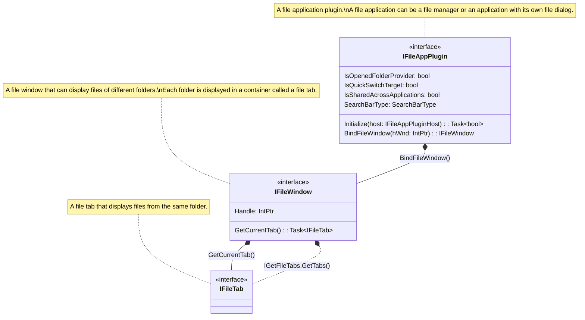
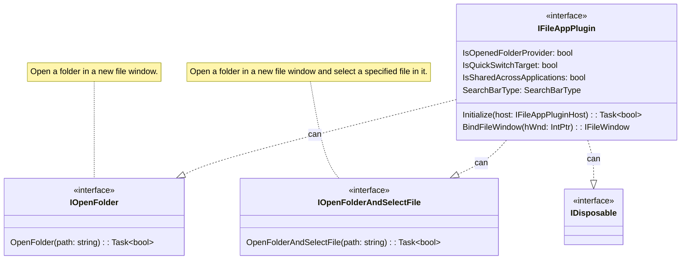
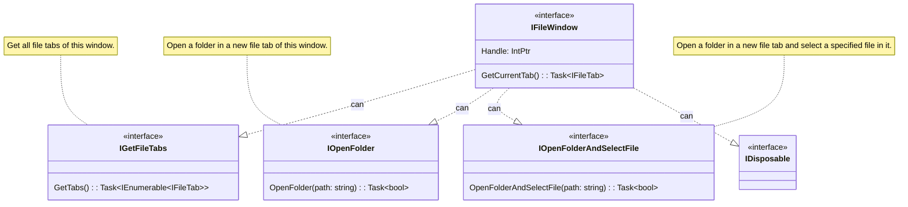
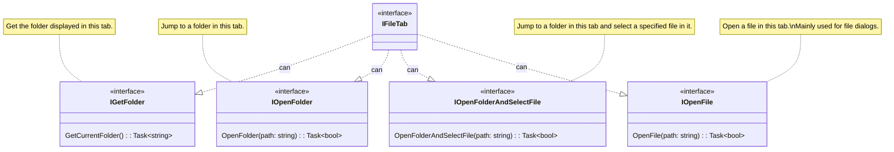

#  Listary.FileAppPlugin

<!--
This README is also included in the NuGet package. Remember to use absolute links to maintain compatibility.

NuGet does not support HTML elements, so there is no need to use absolute links in , because even then they will not be displayed properly.
-->

[Listary](https://www.listary.com/) file application plugin interfaces.

- [Getting Started](https://github.com/listary/Listary.FileAppPlugin/blob/master/docs/Getting%20Started.md)
- [Plugin Repository](https://github.com/listary/Listary.FileAppPlugin.Repository)

## Architecture diagrams

### [IFileAppPlugin](https://github.com/listary/Listary.FileAppPlugin/blob/master/Listary.FileAppPlugin/IFileAppPlugin.cs)

### [IFileWindow](https://github.com/listary/Listary.FileAppPlugin/blob/master/Listary.FileAppPlugin/IFileWindow.cs)

### [IFileTab](https://github.com/listary/Listary.FileAppPlugin/blob/master/Listary.FileAppPlugin/IFileTab.cs)
