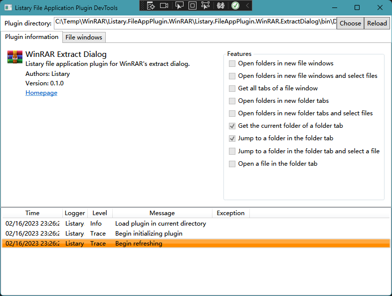

# Getting Started
In this tutorial, we will create a plugin for WinRAR (a file archiver) to learn how to develop a file application plugin. You are assumed to have basic knowledge of [C#](https://learn.microsoft.com/en-us/dotnet/csharp/tour-of-csharp/) and [Win32 windows](https://learn.microsoft.com/en-us/windows/win32/winmsg/about-windows). The complete source code for this plugin can be found at [Listary.FileAppPlugin.WinRAR](https://github.com/listary/Listary.FileAppPlugin.WinRAR).

WinRAR has an "Extraction path and options" dialog, which is not a system file dialog, and therefore Listary does not support it without integration. To support this dialog, we can create a file application plugin for WinRAR.


## Setting up the project
Before beginning to write the code, we need to create a class library project targeting .NET Framework:


Typically, project names should follow a pattern like `Listary.FileAppPlugin.[ApplicationName]`, for example, `Listary.FileAppPlugin.WinRAR`. But here we are not developing a plugin for the main window of WinRAR, `Listary.FileAppPlugin.WinRAR.ExtractDialog` would be a more appropriate name for our plugin.

The framework version should be .NET Framework 4.8.


After creating the project, we need to add the plugin interface package [Listary.FileAppPlugin](https://www.nuget.org/packages/Listary.FileAppPlugin) to our project:


## Adding the plugin manifest
A manifest file is required for the plugin to be recognized. The manifest file should be a JSON file named `ListaryPluginManifest.json`. You can add it to your project:


The manifest file should contain the following content for our plugin:
```json
{
  "ManifestVersion": 1,

  "Id": "WinRAR.ExtractDialog",
  "PluginType": "FileAppPlugin",
  "PluginVersion": "0.1.0",
  "DisplayName": "WinRAR Extract Dialog",
  "Authors": [ "Listary" ],
  "Description": "Listary file application plugin for WinRAR's extract dialog.",
  "Homepage": "https://github.com/listary/Listary.FileAppPlugin.WinRAR",
  "Icon": "Icon.png",

  "Api": "NetFramework",
  "ApiVersion": 1,
  "Entry": "Listary.FileAppPlugin.WinRAR.ExtractDialog.dll"
}
```


- Id

  Id is an identifier used to uniquely identify our plugin. You can use the project name stripped of the common parts as your Id. You **must not** change your Id after the first release, as doing so will break configuration compatibility on users' computers.

- DisplayName

  The name of your plugin to be display o the user interface.

- Homepage

  Homepage of your plugin. We recommend using the GitHub repository as the plugin's homepage.

- Icon

  Acceptable image formats include `png` and `jpg`.

  To simplify the build process, you can add the icon file to the project and select `Copy if newer` in the `Copy to Output Directory` property, as shown below.

- Api

  Since we are making a .NET Framework plugin, it should be `NetFramework`.

- Entry

  The filename of the assembly containing your plugin classes, which would be `[ProjectName].dll` for a project with the default configuration.

After adding the manifest file to the project, you should select `Copy if newer` in `Copy to Output Directory` property in the file properties of `ListaryPluginManifest.json`. This will automatically copy the manifest to the output directory after each build.


## Implementing IFileAppPlugin
The entry point of the plugin is `IFileAppPlugin`, which is defined as follows:
```csharp
/// <summary>
/// A file application plugin. A file application can be a file manager or an application with its own file dialog.
/// 
/// <para>
///   This interface can be implemented with: ...
/// </para>
/// </summary>
public interface IFileAppPlugin
{
    /// <summary>
    /// Whether the folders opened by this file application should be shared with other applications.
    /// <para>
    ///   Currently, this property determines:
    ///   <list type="bullet">
    ///       <item>Whether this file application is used as a source for Quick Switch.</item>
    ///       <item>Whether the folders opened by this file application are displayed in the Currently Opened Folders menu.</item>
    ///   </list>
    ///   This property should be <c>true</c> for file managers and <c>false</c> for file dialogs.
    /// </para>
    /// </summary>
    bool IsOpenedFolderProvider { get; }

    /// <summary>
    /// Whether to automatically switch to the folder opened in other file applications after
    /// pressing hotkeys or switching folders in other file applications.
    /// <para>
    ///   This property should be <c>true</c> for file dialogs and <c>false</c> for file managers.
    /// </para>
    /// </summary>
    bool IsQuickSwitchTarget { get; }

    /// <summary>
    /// Whether the file window of this file application is used by other applications.
    /// This property is used to determine the configuration scope of the plugin.
    /// <para>
    ///   This property should be <c>false</c> for file managers and most non-system file dialogs.
    /// </para>
    /// </summary>
    bool IsSharedAcrossApplications { get; }

    /// <summary>
    /// Which type of search bar to use for this file application.
    /// <para>
    ///   Commonly, <see cref="SearchBarType.Floating"/> is used for file managers and
    ///   <see cref="SearchBarType.Fixed"/> is used for file dialogs.
    /// </para>
    /// </summary>
    SearchBarType SearchBarType { get; }

    /// <summary>
    /// Initialize the plugin.
    /// </summary>
    Task<bool> Initialize(IFileAppPluginHost host);

    /// <summary>
    /// Bind an external window to <see cref="IFileWindow"/>.
    /// </summary>
    /// <returns><c>null</c> if the window cannot be bound (i.e. is an unknown window for the plugin)</returns>
    IFileWindow BindFileWindow(IntPtr hWnd);
}
```

According to the comment, our plugin should be coded as:

```csharp
namespace Listary.FileAppPlugin.WinRAR.ExtractDialog
{
    public class ExtractDialogPlugin : IFileAppPlugin
    {
        private IFileAppPluginHost _host;

        public bool IsOpenedFolderProvider => false;
        
        public bool IsQuickSwitchTarget => true;
        
        public bool IsSharedAcrossApplications => false;

        public SearchBarType SearchBarType => SearchBarType.Fixed;
        
        public async Task<bool> Initialize(IFileAppPluginHost host)
        {
            _host = host;
            return true;
        }

        public IFileWindow BindFileWindow(IntPtr hWnd)
        {
            // ...
        }
    }
}
```

To implement `BindFileWindow`, we need to find a way to identify WinRAR's extract dialog. We can use Visual Studio's [Spy++](https://learn.microsoft.com/en-us/visualstudio/debugger/introducing-spy-increment) to do this. You can start Spy++ from the menu:


After starting it, you should open the WinRAR's extract dialog, refresh the windows in Spy++ and find the window of WinRAR's extract dialog:


Once you have found the dialog, you can expand it and see its entire window tree:


There are several ways to identify this dialog:
- Identifying by the class name of the window

  Identifying by class name is the most common approach. However, if the class name is a common name, such as `#32770`, you will need to combine other approaches to identify the window accurately.
  
- Identifying by the window's process name

  When identifying by the process name, make sure that you have covered all the editions of the application. Different editions of the application may have different process names for some applications.

- Identifying by the ID of controls in the window

  You can view the ID of a control in Spy++:

  

- Identifying by the title of the window

  Identifying by the title is usually not recommended because the title can change between different languages and versions.

Here is how we identify WinRAR's extract dialog:

```csharp
public IFileWindow BindFileWindow(IntPtr hWnd)
{
    // It is a Win32 dialog box?
    if (Win32Utils.GetClassName(hWnd) == "#32770")
    {
        // It is from WinRAR?
        if (Win32Utils.GetProcessPathFromHwnd(hWnd).EndsWith("\\WinRAR.exe", StringComparison.OrdinalIgnoreCase))
        {
            // It is WinRAR's extract dialog?
            // GetDlgItem() is used to retrieve the handle to a control with the specified ID
            IntPtr tab = Win32Utils.GetDlgItem(hWnd, 0x3020);
            if (Win32Utils.GetClassName(tab) == "SysTabControl32")
            {
                return new ExtractDialogWindow(_host, hWnd);
            }
        }
    }
    return null;
}
```

In this process, you will usually need to call some Win32 APIs. You can get P/Invoke signatures of the APIs you want to use from [pinvoke.net: the interop wiki!](https://pinvoke.net/). You can also use the [C#/Win32 P/Invoke Source Generator](https://github.com/microsoft/CsWin32), but this requires you to change language version of the project to at least C# 9.

## Implementing IFileWindow and IFileTab
`IFileWindow` and `IFileTab` are the interfaces Listary uses to manipulate the file window. How to implement them depends on the GUI framework used by the application you want to target:

- For Win32, MFC and Windows Forms, you can manipulate their windows using window messages. See [Common Controls](https://learn.microsoft.com/en-us/windows/win32/controls/individual-control-info) for more information.

- For other GUI frameworks, including Qt, XAML-based GUI (WPF, UWP, WinUI and Avalonia UI) and web-based GUI (Electron and CEF), you can manipulate their windows using [UI Automation](https://learn.microsoft.com/dotnet/framework/ui-automation/ui-automation-overview) (successor to Microsoft Active Accessibility).

- If the application is extensible or you are just the developer, you can implement them using IPC.

WinRAR uses MFC, so here we will implement `IFileWindow` and `IFileTab` using window messages.

`IFileWindow` is defined as:
```csharp
/// <summary>
/// A file window that can display files of different folders.
/// Each folder is displayed in a container called a file tab (<see cref="IFileTab"/>).
/// 
/// <para>
///   This interface can be implemented with: ...
/// </para>
/// </summary>
public interface IFileWindow
{
    IntPtr Handle { get; }

    /// <summary>
    /// Get the current file tab.
    /// </summary>
    Task<IFileTab> GetCurrentTab();
}
```

Our implementation for `IFileWindow` is very simple:

```csharp
namespace Listary.FileAppPlugin.WinRAR.ExtractDialog
{
    public class ExtractDialogWindow : IFileWindow
    {
        private IFileAppPluginHost _host;

        public IntPtr Handle { get; }

        public ExtractDialogWindow(IFileAppPluginHost host, IntPtr hWnd)
        {
            Handle = hWnd;
            _host = host;
        }

        public async Task<IFileTab> GetCurrentTab()
        {
            return new ExtractDialogTab(_host, Handle);
        }
    }
}
```

You may be confused about `GetCurrentTab` because the extract dialog does not contain a folder tab. The key is to understand that a "file tab" in a file application plugin is actually "a container that can display a folder", it is not necessary to have a real tab control.

`IFileTab` is defined as:

```csharp
/// <summary>
/// A file tab that displays files from the same folder.
/// <para>
/// This interface can be implemented with:
///   <list type="bullet">
///     <item><term><see cref="IGetFolder"/></term>
///       <description>Get the folder displayed in this tab.</description>
///     </item>
///     <item><term><see cref="IOpenFolder"/></term>
///       <description>Jump to a folder in this tab.</description>
///     </item>
///     <item><term><see cref="IOpenFolderAndSelectFile"/></term>
///       <description>Jump to a folder in this tab and select a specified file in it.</description>
///     </item>
///     <item><term><see cref="IOpenFile"/></term>
///       <description>Open a file in this tab. Mainly used for file dialogs.</description>
///     </item>
///   </list>
/// </para>
/// </summary>
public interface IFileTab
{
}
```

And our implementation:

```csharp
namespace Listary.FileAppPlugin.WinRAR.ExtractDialog
{
    public class ExtractDialogTab : IFileTab, IGetFolder, IOpenFolder
    {
        private IFileAppPluginHost _host;
        private IntPtr _pathEditor = IntPtr.Zero;
        private IntPtr _displayButton = IntPtr.Zero;

        public ExtractDialogTab(IFileAppPluginHost host, IntPtr dialog)
        {
            _host = host;

            IntPtr general = Win32Utils.FindWindowEx(dialog, IntPtr.Zero, "#32770", null);
            if (general == IntPtr.Zero)
            {
                _host.Logger.LogError("Failed to find General dialog");
                return;
            }

            _displayButton = Win32Utils.GetDlgItem(general, 0x66);
            if (_displayButton == IntPtr.Zero)
            {
                _host.Logger.LogWarning("Failed to find Display button");
            }

            IntPtr comboBox = Win32Utils.GetDlgItem(general, 0x65);
            if (comboBox == IntPtr.Zero)
            {
                _host.Logger.LogError("Failed to find the path combo box");
                return;
            }

            _pathEditor = Win32Utils.GetDlgItem(comboBox, 0x3E9);
            if (_pathEditor == IntPtr.Zero)
            {
                _host.Logger.LogError("Failed to find the path editor");
            }
        }

        public async Task<string> GetCurrentFolder()
        {
            if (_pathEditor != IntPtr.Zero)
            {
                return _host.GetWindowText(_pathEditor);
            }
            return string.Empty;
        }

        public async Task<bool> OpenFolder(string path)
        {
            if (_pathEditor != IntPtr.Zero)
            {
                if (_host.SetWindowText(_pathEditor, path))
                {
                    _host.PostMessage(_displayButton, Win32Utils.BM_CLICK, IntPtr.Zero, IntPtr.Zero);
                    return true;
                }
                else
                {
                    _host.Logger.LogError("Failed to set the text of the path editor");
                }
            }
            return false;
        }
    }
}
```

Finally, you should make sure that all your classes implementing a plugin interface are **public**, otherwise the plugin will not load properly.

## Testing the plugin
After we have completed our plugin, we can test it using File Application Plugin DevTools.

You can set the project's start action to launch DevTools:


There is no need to specify the command line arguments as DevTools will automatically load the plugin from the working directory.

After you start debugging, DevTools will load the plugin and display the plugin information for you to check.



Then you can switch to the `File windows` tab, it will show all the opened WinRAR's extract dialog if `BindWindow` is working correctly. To test `IOpenFolder`, you can right click on the target item and select `Jump tp C:\Program Files`.


After testing in DevTools, you can copy the output directory to Listary's plugins directory (`C:\Program Files\Listary\FileAppPlugins`) and test the plugin with Listary:


## Submitting the plugin
After you have finished the plugin, you can submit it by creating a pull request to [Listary.FileAppPlugin.Repository](https://github.com/listary/Listary.FileAppPlugin.Repository). Please note that for security reasons we do not accept any closed-source plugins.